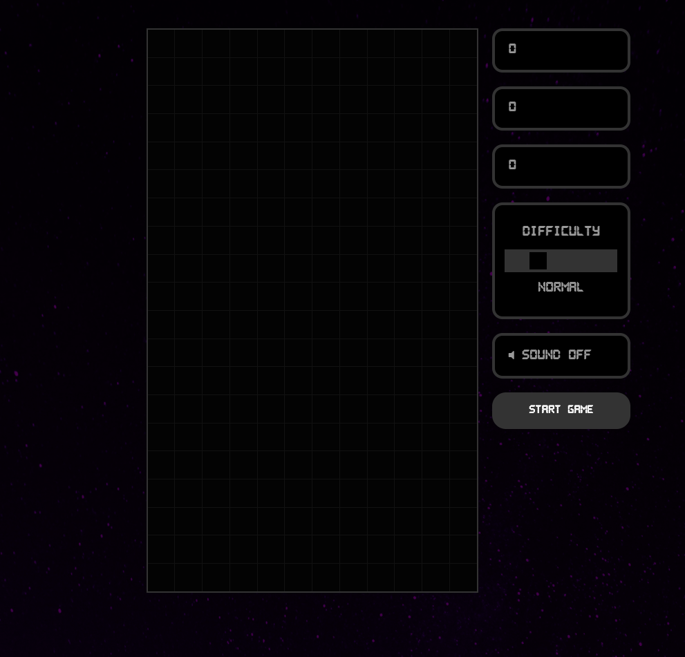
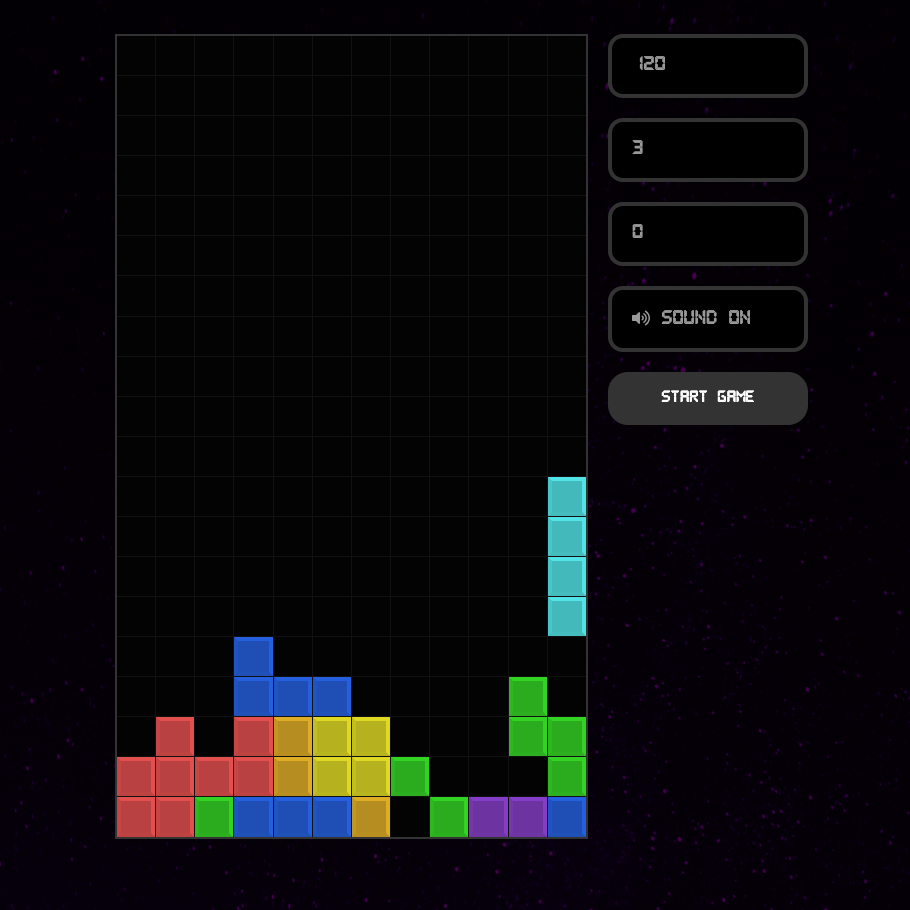

# SITE TITLE GOES HERE

## Table of contents

- [Overview](#overview)
  - [The Project](#the-project)
  - [Screenshot](#screenshot)
  - [Links](#links)
- [My process](#my-process)
  - [Built with](#built-with)
  - [What I learned](#what-i-learned)
  - [Continued development](#continued-development)
  - [Useful resources](#useful-resources)
- [Author](#author)
- [Acknowledgments](#acknowledgments)

## Overview

### The project
This is a clone of Tetris. It's a game. Maybe you've heard of it?

### Screenshots
 
 

### Links

- Solution URL: [Git](https://github.com/joshuagraber/tetris-clone)
- Live Site URL: [Live Site](https://kind-hopper-e48191.netlify.app/)

## My process

### Built with
- React.js
  - Hooks, including custom hooks

### What I learned
I loved this project, because it helped me get much more comfortable with React hooks. Because I'm not very comfortable building games yet, I leaned on several tutorials for this one, but I made it my own, as well.

### Continued development
Right now, I'm working on a portfolio and blog, constructed as a Single Page Application with Router and several hooks, and using Wordpress as a headless CMS.

### Useful resources
[Weibenfalk YouTube Tutorial](https://www.youtube.com/watch?v=ZGOaCxX8HIU)
[Devmentorlive YouTube Tutorial](https://www.youtube.com/watch?v=arX8I7H3zlM)
[Jack He YouTube Tutorial](https://www.youtube.com/watch?v=OvD7CE6_W08)

## Author

- Github - [@joshuagraber](https://www.github.com/joshuagraber)

## Acknowledgments
I copied a lot of the structure and some code verbatim from Weibenfalk's tutorial. I probably wouldn't have finished this without his help.